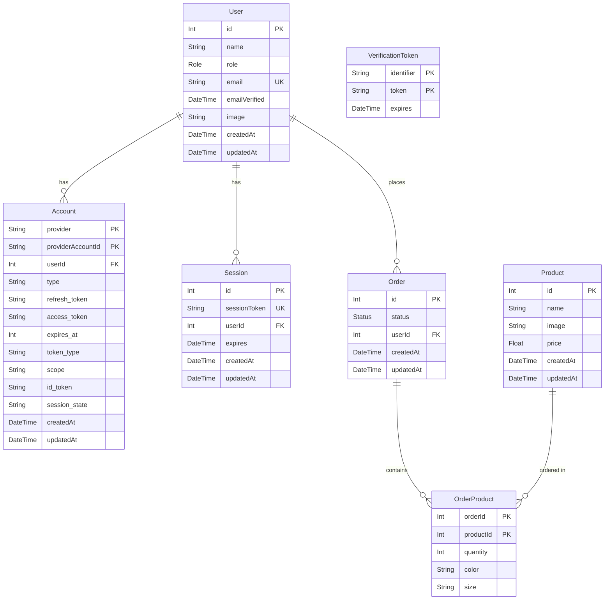

# Aplicação de E-commerce

Uma aplicação de e-commerce full-stack construída com Next.js, Prisma ORM e PostgreSQL, featuring autenticação OAuth através do NextAuth e um sistema de lista de desejos de produtos.

## Stack de Tecnologia

| Componente | Tecnologia | Versão |
|-----------|------------|---------|
| Framework | Next.js | 15.5.3 |
| Linguagem | JavaScript (ES Modules) | - |
| Banco de Dados | PostgreSQL | - |
| ORM | Prisma | 6.16.2 (CLI), 6.16.1 (Client) |
| Autenticação | NextAuth.js | 4.24.11 |
| Adaptador de Auth | @next-auth/prisma-adapter | 1.0.7 |
| Framework UI | React | 19.1.0 |
| Estilização | Tailwind CSS | 4 |
| Ícones | Heroicons | 2.2.0 |
| Componentes | Headless UI | 2.2.9 | [1](#3-0) 

## Arquitetura do Banco de Dados

O banco de dados utiliza PostgreSQL como sistema gerenciador de banco de dados relacional, acessado através do Prisma ORM para operações de banco de dados type-safe. A conexão é configurada através da variável de ambiente `DATABASE_URL` [2](#3-1) .

## Modelos e Relações

### Diagrama de Entidade-Relacionamento




### Modelo User
Entidade central para autenticação e dados do usuário [5](#3-4) :
- Chave primária: `id` auto-incrementável
- Restrição de email único
- Autorização baseada em roles (USER/ADMIN)
- Relações com os modelos Account, Session e Product

### Modelo Product
Representa itens do e-commerce com funcionalidade de lista de desejos [6](#3-5) :
- ID manual (sem auto-incremento)
- Enum de status para ciclo de vida do produto
- Relação opcional com User para lista de desejos

### Modelo Account
Armazena informações do provider OAuth [7](#3-6) :
- Chave primária composta: `[provider, providerAccountId]`
- Armazenamento de tokens com mapeamento de campos personalizado
- Exclusão em cascata na remoção do usuário

### Modelo Session
Gerencia sessões de usuário ativas [8](#3-7) :
- Token de sessão único
- Timestamp de expiração
- Comportamento de exclusão em cascata

### Modelo VerificationToken
Gerencia tokens de verificação de email e reset de senha [9](#3-8) :
- Chave primária composta: `[identifier, token]`
- Sem relações de chave estrangeira

### Enums

**Enum Role** [10](#3-9) :
- `USER` (padrão)
- `ADMIN`

**Enum Status** [11](#3-10) :
- `PAID`
- `SHIPPED`
- `DELIVERED`
- `WAITING_FOR_PAYMENT`

## Queries Prisma e Traduções SQL

### Padrões Comuns de Queries

Baseado no schema, aqui estão queries Prisma típicas e seus equivalentes SQL:

## Lookup de Autenticação de Usuário

**Prisma:**
```javascript
const user = await prisma.user.findUnique({
  where: { email: "user@example.com" },
  include: { accounts: true, sessions: true }
});
```

**SQL:**
```sql
SELECT 
  u."id", u."name", u."role", u."email", u."emailVerified", u."image", u."createdAt", u."updatedAt",
  a."provider", a."providerAccountId", a."type", a."refresh_token", a."access_token", a."expires_at", a."token_type", a."scope", a."id_token", a."session_state", a."createdAt" AS "accountCreatedAt", a."updatedAt" AS "accountUpdatedAt",
  s."id" AS "sessionId", s."sessionToken", s."expires", s."createdAt" AS "sessionCreatedAt", s."updatedAt" AS "sessionUpdatedAt"
FROM "User" u
LEFT JOIN "Account" a ON a."userId" = u."id"
LEFT JOIN "Session" s ON s."userId" = u."id"
WHERE u."email" = 'user@example.com';
```

## Pegar produtos para landing page

**Prisma:**
```javascript
async function getProduct(productId) {
  const product = await prisma.product.findUnique({
    where: {
      id: productId
    },
  });
  return product;
}
```

**SQL:**
```sql
SELECT * FROM "Product" WHERE id = productId (passado pelo servidor)
```

## Finalizar compra e atualizar estado do pedido

**Prisma:**
```javascript
async function finalizeOrder(orderId) {
  "use server";
  const order = await prisma.order.update({
    where: {
      id: orderId,
    },
    data: {
      status: "PAID",
    },
  });
}
```

**SQL:**
```sql
UPDATE "Order"   
SET "status" = 'PAID', "updatedAt" = NOW()  
WHERE "id" = $1  
RETURNING "id", "userId", "status", "createdAt", "updatedAt";
```


## Exemplo de transação

**Prisma:**
```javascript
  const newOrder = await prisma.$transaction(async (tx) => {
    const newOrder = await prisma.order.create({
      data: {
        userId: userId,
        status: "WAITING_FOR_PAYMENT",
        products: {
          create: items.map((item) => ({
            productId: item.id,
            quantity: item.quantity,
            color: item.color || null,
            size: item.size || null,
          })),
        },
      },
    });
    return newOrder;
```

**SQL:**
```sql
BEGIN;  
  
INSERT INTO "Order" ("userId", "status", "createdAt", "updatedAt")  
VALUES ($1, 'WAITING_FOR_PAYMENT', NOW(), NOW())  
RETURNING "id", "userId", "status", "createdAt", "updatedAt";  
  
INSERT INTO "OrderProduct" ("orderId", "productId", "quantity", "color", "size")  
VALUES   
  ($2, $3, $4, $5, $6),  
  ($2, $7, $8, $9, $10),  
  -- ... Adicionando os valores para cada produto no pedido
;  
  
COMMIT;
```


## Gerenciamento de Sessão

**Prisma:**
```javascript
// Criar sessão
const session = await prisma.session.create({
  data: {
    sessionToken: token,
    userId: user.id,
    expires: expirationDate
  }
});

// Validar sessão
const validSession = await prisma.session.findUnique({
  where: { sessionToken: token },
  include: { user: true }
});
```

**SQL:**
```sql
-- Criar sessão
INSERT INTO "Session" ("sessionToken", "userId", "expires", "createdAt", "updatedAt")
VALUES ($1, $2, $3, NOW(), NOW())
RETURNING "id", "sessionToken", "userId", "expires", "createdAt", "updatedAt";

-- Validar sessão
SELECT 
  s."id", s."sessionToken", s."userId", s."expires", s."createdAt", s."updatedAt",
  u."id" AS "userId", u."name", u."role", u."email", u."emailVerified", u."image", u."createdAt" AS "userCreatedAt", u."updatedAt" AS "userUpdatedAt"
FROM "Session" s
INNER JOIN "User" u ON u."id" = s."userId"
WHERE s."sessionToken" = $1;
```


## Triggers, Views e Procedures

### Trigger para garantir o estado correto dos pedidos

```sql
CREATE OR REPLACE FUNCTION validate_order_status_transition()  
RETURNS TRIGGER AS $$  
BEGIN  
  IF TG_OP = 'INSERT' THEN  
    RETURN NEW;  
  END IF;  
    
  IF OLD.status IS DISTINCT FROM NEW.status THEN  
    IF OLD.status = 'WAITING_FOR_PAYMENT' AND NEW.status NOT IN ('PAID', 'WAITING_FOR_PAYMENT') THEN  
      RAISE EXCEPTION 'Invalid status transition from WAITING_FOR_PAYMENT to %', NEW.status;  
    END IF;  
      
    IF OLD.status = 'PAID' AND NEW.status NOT IN ('SHIPPED', 'PAID') THEN  
      RAISE EXCEPTION 'Invalid status transition from PAID to %', NEW.status;  
    END IF;  
      
    IF OLD.status = 'SHIPPED' AND NEW.status NOT IN ('DELIVERED', 'SHIPPED') THEN  
      RAISE EXCEPTION 'Invalid status transition from SHIPPED to %', NEW.status;  
    END IF;  
      
    IF OLD.status = 'DELIVERED' AND NEW.status != 'DELIVERED' THEN  
      RAISE EXCEPTION 'Cannot change status from DELIVERED (final state)';  
    END IF;  
  END IF;  
    
  RETURN NEW;  
END;  
$$ LANGUAGE plpgsql;
```

### View para analytics do usuário

```sql
CREATE VIEW "UserOrderSummary" AS
SELECT
    u.id as user_id,
    u.name as user_name,
    u.email,
    COUNT(o.id) as total_orders,
    COALESCE(SUM(op.quantity * op.), 0) as total_spent,
    MAX(o.createdAt) as last_order_date
FROM "User" u
LEFT JOIN "Order" o ON u.id = o."userId"
LEFT JOIN "OrderProduct" op ON o.id = op."orderId"
LEFT JOIN "Product" p ON p.id
GROUP BY u.id, u.name, u.email;
```

### Procedure para calcular o preço total do pedido

```sql
CREATE OR REPLACE PROCEDURE "CalculateOrderTotal"(order_id_param INTEGER)
LANGUAGE plpgsql
AS $$
DECLARE
    order_total DECIMAL;
BEGIN
    SELECT COALESCE(SUM(quantity * purchasedPrice), 0)
    INTO order_total
    FROM "orderProduct"
    WHERE "orderId" = order_id_param;
    UPDATE "Order" SET total_value = order_total WHERE id = order_id_param;
    RAISE NOTICE 'Order % total: %', order_id_param, order_total;
END;
$$;
```

[Schema final do banco de dados](https://github.com/eduardolsoares/e_commerce_dbii/blob/dev/schema.sql)

